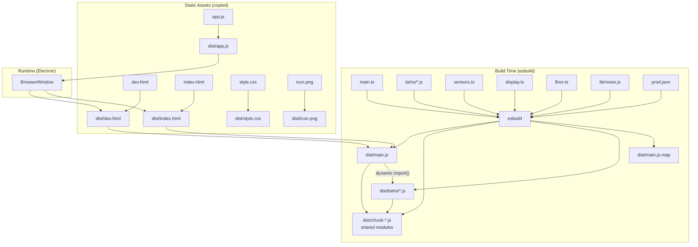
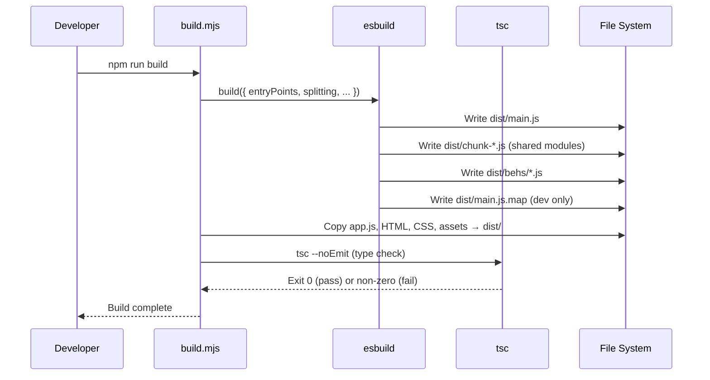
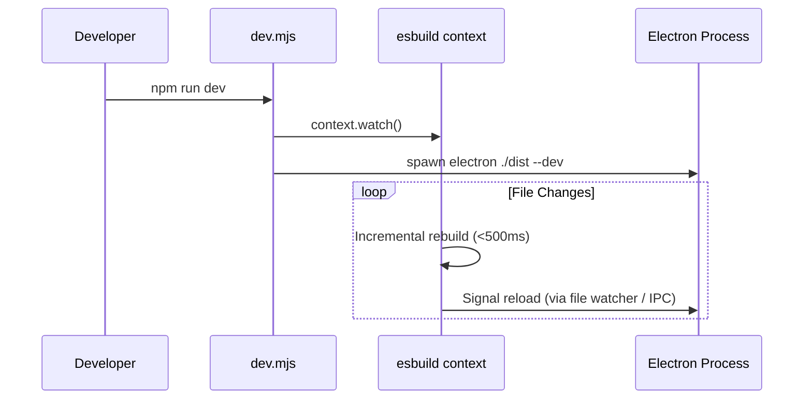
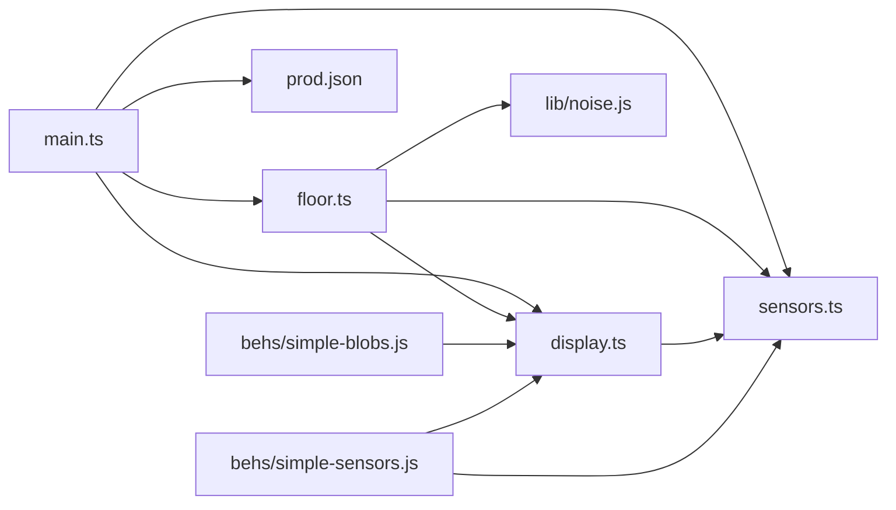
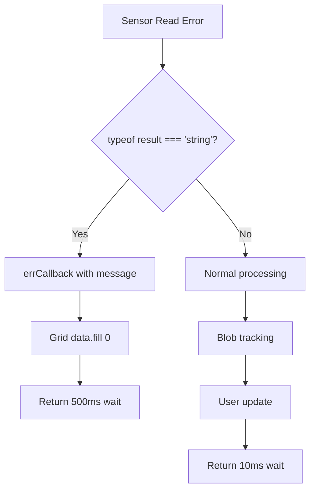

# Design Document: esbuild Migration

## Overview

This design migrates the MoMath Math Square Electron app's renderer-process build pipeline from SystemJS/jspm (runtime TypeScript transpilation) to esbuild (build-time bundling). The core architectural decision is to use **esbuild with ESM format and code splitting**, which allows:

1. A single main entry bundle loaded by the HTML page
2. Behaviors as separate dynamically-imported ESM chunks
3. Shared modules (sensors, display, floor) extracted into common chunks — no duplication
4. Sub-second incremental rebuilds during development

The Electron main process (`app.js`) remains unbundled CommonJS, loaded directly by Electron's Node.js runtime.

### Key Design Decisions

| Decision | Choice | Rationale |
|----------|--------|-----------|
| Output format | ESM (`format: 'esm'`) | Electron 31+ (Chromium 126) fully supports ES modules; enables native dynamic `import()` for behaviors |
| Code splitting | Enabled (`splitting: true`) | Extracts shared modules into chunks so behaviors and main share the same instances (Req 2.2) |
| Build API | esbuild JavaScript API (not CLI) | Provides programmatic control for watch mode, multiple entry points, and custom plugins |
| Behavior discovery | Glob `behs/*.js` at build time | Each behavior becomes an entry point; adding a new .js file and rebuilding is all that's needed |
| Bare specifier resolution | esbuild `alias` config | Maps `'sensors'` → `./sensors.ts`, `'display'` → `./display.ts`, etc. |
| lib/noise.js integration | Convert to proper ESM export | Replace global `var` with `export { SimplexNoise }` and update floor.ts to named import |
| app.js handling | Copied as-is (not bundled) | Preserves CommonJS `require()` calls for Electron native module loading |
| Type checking | Separate `tsc --noEmit` step | esbuild strips types without checking; TypeScript 5.x validates separately |

## Architecture



### Build Pipeline



### Dev Mode Pipeline



## Components and Interfaces

### 1. Build Script (`build.mjs`)

The primary build orchestrator. Uses esbuild's JavaScript API.

```typescript
interface BuildConfig {
  entryPoints: string[];      // ['main.ts', 'behs/simple-blobs.js', ...]
  outdir: string;             // 'dist'
  bundle: boolean;            // true
  splitting: boolean;         // true
  format: 'esm';
  target: 'chrome126';
  platform: 'browser';
  sourcemap: boolean | 'external'; // true for dev, false for prod
  minify: boolean;            // true for prod only
  treeShaking: boolean;       // true
  alias: Record<string, string>;
  external: string[];         // ['electron', 'electron-log', ...]
  loader: Record<string, string>; // { '.json': 'json' }
}
```

**Responsibilities:**
- Discover behavior entry points via `fs.readdirSync('behs/')`
- Configure and invoke esbuild
- Copy static assets (app.js, HTML, CSS, icon) to `dist/`
- Transform HTML files (strip SystemJS references, add `<script type="module">`)
- Run `tsc --noEmit` for type checking (production builds)
- Exit with appropriate codes

### 2. Dev Script (`dev.mjs`)

Development workflow orchestrator with watch mode.

**Responsibilities:**
- Create esbuild context with watch enabled
- Copy/transform assets on startup
- Watch for new behavior files added to `behs/`
- Launch Electron subprocess (`electron ./dist --dev`)
- Reload Electron renderer on successful rebuilds
- Display build errors in terminal without replacing last good bundle

### 3. Module Alias Resolution

esbuild's `alias` option maps bare specifiers to source files:

```javascript
alias: {
  'sensors': './sensors.ts',
  'display': './display.ts',
  'floor':   './floor.ts',
  'prod':    './prod.json',
  'lib/noise': './lib/noise.js',
}
```

This replaces the 300-line SystemJS `config.js` mapping.

### 4. HTML Template Processing

Both `dev.html` and `index.html` are transformed during the build:

**Before (current):**
```html
<script src="packages/system.js"></script>
<script src="config.js"></script>
<script>function main() { SystemJS.import('main'); }</script>
<body onload="main()">
```

**After (migrated):**
```html
<script type="module" src="main.js"></script>
<body>
```

The `<div id="scene">`, form controls in dev.html, and stylesheet link are preserved.

### 5. Entry Point Modifications (main.ts)

Key changes to main.ts for the migration:

| Current | Migrated | Reason |
|---------|----------|--------|
| `System.import("electron")` | `const electron = await import('electron').catch(() => null)` | Native ESM dynamic import |
| `System.import("behs/simple-sensors")` | `import('./behs/simple-sensors.js')` | Native ESM dynamic import |
| `import 'lib/noise'` (in floor.ts) | `import { SimplexNoise } from 'lib/noise'` | Proper ESM export/import |

### 6. lib/noise.js Conversion

Current: declares `var SimplexNoise` as a script-global.
Migrated: exports the constructor as a named ESM export.

```javascript
// End of lib/noise.js — add:
export { SimplexNoise };
```

Update `floor.ts`:
```typescript
import { SimplexNoise } from 'lib/noise';
```

Update `lib/noise.d.ts`:
```typescript
export declare const SimplexNoise: any;
```

### 7. package.json Changes

```json
{
  "type": "module",
  "engines": { "node": ">=22" },
  "main": "dist/app.js",
  "scripts": {
    "build": "node build.mjs",
    "dev": "node dev.mjs",
    "start": "npm run build && electron-forge start",
    "typecheck": "tsc --noEmit",
    "package": "npm run build && electron-forge package",
    "make": "npm run build && electron-forge make"
  },
  "dependencies": {
    "electron-log": "^5.0.0"
  },
  "devDependencies": {
    "esbuild": "^0.21.0",
    "typescript": "^5.5.0",
    "electron": "^31.3.1",
    "@electron-forge/cli": "^7.4.0",
    "@electron-forge/maker-squirrel": "^7.4.0",
    "@electron-forge/maker-zip": "^7.4.0",
    "@electron-forge/plugin-auto-unpack-natives": "^7.4.0",
    "@electron-forge/plugin-fuses": "^7.4.0",
    "@electron/fuses": "^1.8.0"
  }
}
```

**Removed:** `jspm`, `jspm` config section, old TypeScript 2.x.  
**Note:** `"type": "module"` in package.json makes `.js` files ESM by default. `app.js` (CommonJS) must be renamed to `app.cjs` or kept in `dist/` without the package.json `type` field applying to it. Since `app.js` is copied to `dist/` (which won't inherit the root `package.json`), this is handled naturally.

### 8. tsconfig.json Update

```json
{
  "compilerOptions": {
    "module": "ESNext",
    "moduleResolution": "bundler",
    "target": "ES2020",
    "strict": true,
    "noEmit": true,
    "esModuleInterop": true,
    "skipLibCheck": true,
    "forceConsistentCasingInFileNames": true,
    "resolveJsonModule": true,
    "paths": {
      "sensors": ["./sensors.ts"],
      "display": ["./display.ts"],
      "floor": ["./floor.ts"],
      "prod": ["./prod.json"],
      "lib/noise": ["./lib/noise.js"]
    }
  },
  "include": ["*.ts", "behs/**/*.js", "lib/**/*.js", "types/**/*.d.ts"]
}
```

## Data Models

### Build Output Structure

```
dist/
├── app.js              # Copied unchanged (CommonJS, Electron main)
├── main.js             # Bundled renderer entry (ESM)
├── main.js.map         # Source map (dev builds only)
├── chunk-XXXXXX.js     # Shared modules chunk (sensors+display+floor)
├── dev.html            # Transformed (no SystemJS)
├── index.html          # Transformed (no SystemJS)
├── style.css           # Copied unchanged
├── icon.png            # Copied unchanged
├── prod.json           # Copied (for reference; content is inlined in bundle)
├── lib/
│   └── noise.js        # Not needed separately (inlined via chunk)
└── behs/
    ├── simple-blobs.js # Bundled behavior (ESM, imports shared chunk)
    └── simple-sensors.js
```

### esbuild Alias Map

| Bare Specifier | Resolved Path | Used By |
|---------------|---------------|---------|
| `'sensors'` | `./sensors.ts` | main.ts, display.ts, floor.ts, behs/*.js |
| `'display'` | `./display.ts` | main.ts, floor.ts, behs/*.js |
| `'floor'` | `./floor.ts` | main.ts |
| `'prod'` | `./prod.json` | main.ts |
| `'lib/noise'` | `./lib/noise.js` | floor.ts |

### Module Dependency Graph



With code splitting, esbuild identifies `sensors.ts` and `display.ts` as shared between main and behaviors, extracting them into a common chunk. `floor.ts` may also be extracted if referenced by behaviors.

### Configuration Files

**forge.config.js** (Electron Forge — updated to point at dist/):
```javascript
module.exports = {
  packagerConfig: {
    dir: 'dist',
    // ... existing forge config
  },
  // ...
};
```


## Correctness Properties

*A property is a characteristic or behavior that should hold true across all valid executions of a system — essentially, a formal statement about what the system should do. Properties serve as the bridge between human-readable specifications and machine-verifiable correctness guarantees.*

### Property 1: Shared module deduplication

*For any* behavior file in `behs/` that imports from `'sensors'`, `'display'`, or `'floor'`, the built output of that behavior SHALL reference a shared chunk file and SHALL NOT contain an inline copy of the module code. The module code for each core module SHALL appear exactly once across all output files.

**Validates: Requirements 2.2**

### Property 2: No legacy runtime references

*For any* file in the `dist/` output directory (excluding source maps), the file content SHALL NOT contain the strings `'SystemJS'`, `'System.config'`, or `'System.import'`.

**Validates: Requirements 8.6**

### Property 3: Module export preservation

*For any* core module (sensors, display, floor) and *for any* expected public export name from that module, the built bundle SHALL make that export accessible with an equivalent value or type. Specifically:
- sensors: `width` (80), `height` (80), `Coord`, `Index`, `NullSource`, `BLSource`, `RaindropSource`, `FilterSource`, `MouseSource`, `PlaybackSource`, `Reader`, `Blobber`, `UIntGrid`
- display: `width` (1024), `height` (1024), `sensorWidth`, `sensorHeight`, `toSensor`, `fromSensor`, `teamColors` (array of 12), `Canvas2DContext`
- floor: `default` (Floor class), `User`, `Ghost`

**Validates: Requirements 9.1, 9.2, 9.3**

### Property 4: Semaphore callback idempotence

*For any* semaphore GUID string, when behavior initialization completes and `sendSemaphoreCallback()` is invoked multiple times, the HTTP fetch to the launcher URL SHALL be executed exactly once.

**Validates: Requirements 9.4**

### Property 5: Error recovery with graceful degradation

*For any* error result (string) returned by a sensor source read, the Floor's sensorUpdate handler SHALL:
1. Zero the sensor grid data
2. Invoke the errCallback with the error string
3. Return a wait time >= 500ms

**Validates: Requirements 9.7**

### Property 6: Sensor source parameterization

*For any* valid sensor type value in `{'null', 'bl', 'raindrop'}` and *for any* mode (DEV or production), when the sensor type is specified via the `sensors` query parameter, the `createSensorSource` function SHALL return an instance of the corresponding source class (`NullSource`, `BLSource`, `RaindropSource`) regardless of the current mode.

**Validates: Requirements 9.9**

## Error Handling

### Build-Time Errors

| Error Condition | Behavior | Exit Code |
|----------------|----------|-----------|
| TypeScript syntax error in source | esbuild reports file:line, terminates | 1 |
| Missing import (unresolved specifier) | esbuild reports the import, terminates | 1 |
| `tsc --noEmit` type errors | Reports error count + locations, terminates | 1 |
| Missing source file (entry point) | esbuild reports ENOENT, terminates | 1 |
| Invalid `prod.json` format | JSON loader reports parse error, terminates | 1 |
| Disk full / write failure | esbuild reports write error, terminates | 1 |

### Dev-Mode Errors

| Error Condition | Behavior |
|----------------|----------|
| Syntax error during watch rebuild | Print error to terminal, preserve last good bundle |
| Electron process crashes | Log crash, do not restart (developer handles manually) |
| New behavior file with syntax error | Report error, skip that entry point in rebuild |

### Runtime Errors

| Error Condition | Behavior |
|----------------|----------|
| `import('./behs/nonexistent.js')` | Promise rejects with path in error message |
| BL server unreachable | `errCallback` invoked, grid zeroed, retry after 500ms |
| BL server returns invalid XML | `errCallback` invoked with rejection reason, grid zeroed |
| Semaphore callback fetch fails | Error logged, app continues normally |
| Behavior `init()` throws | `fatal()` called — in dev mode logs; in prod relaunches |

### Error Propagation Strategy



## Testing Strategy

### Test Categories

**1. Build Integration Tests (Example-Based)**

These verify the build system produces correct outputs:
- Build completes with exit 0
- Output files exist in expected locations
- HTML files are correctly transformed (no SystemJS, one script tag, preserves elements)
- `app.js` is copied unchanged
- Source maps produced in dev mode, absent in production
- Minification applied in production builds
- Alias resolution produces correct imports

**2. Property-Based Tests**

Using [fast-check](https://github.com/dubzzz/fast-check) (JavaScript PBT library):

| Property | Generator | Assertion |
|----------|-----------|-----------|
| P1: Shared module dedup | Arbitrary behavior files importing core modules | Built output references shared chunk, no inline duplication |
| P2: No legacy references | All files in dist/ | No SystemJS/System.config/System.import strings |
| P3: Export preservation | Set of (module, export-name) pairs | Each export is accessible with correct value/type |
| P4: Semaphore idempotence | Arbitrary GUID strings | fetch called exactly once regardless of invocation count |
| P5: Error recovery | Arbitrary error strings | Grid zeroed, callback invoked, wait >= 500 |
| P6: Sensor source params | Combinations of {type} × {mode} | Correct source class instantiated |

**Configuration:**
- Minimum 100 iterations per property test
- Each test tagged: `Feature: esbuild-migration, Property N: <title>`

**3. Unit Tests (Example-Based)**

Focused example tests for specific scenarios:
- `createSensorSource('bl')` with URL → returns BLSource
- `createSensorSource('bl')` without URL → falls through to NullSource  
- Semaphore callback skipped when GUID is null
- HTML transformation removes `onload` attribute
- `dev.html` preserves form controls after transformation
- Type checking catches intentional errors

**4. Smoke Tests**

Quick pass/fail checks for configuration correctness:
- `npm run build` exits 0
- `npm run dev` starts without immediate crash
- `tsc --noEmit` exits 0
- Package.json has no `jspm` section
- tsconfig has `strict: true`
- esbuild target is `chrome126`
- Node engines >= 22

### Test Execution

```bash
# All tests
npm test

# Property tests only
npm test -- --grep "Property"

# Build integration tests
npm test -- --grep "Build"

# Type checking
npm run typecheck
```

### Testing Tools

- **Test Runner:** Vitest (fast, ESM-native, good TypeScript support)
- **Property Testing:** fast-check (mature JS PBT library)
- **Assertions:** Vitest built-in (`expect`)
- **Build Testing:** Spawn build scripts as child processes, inspect output files

