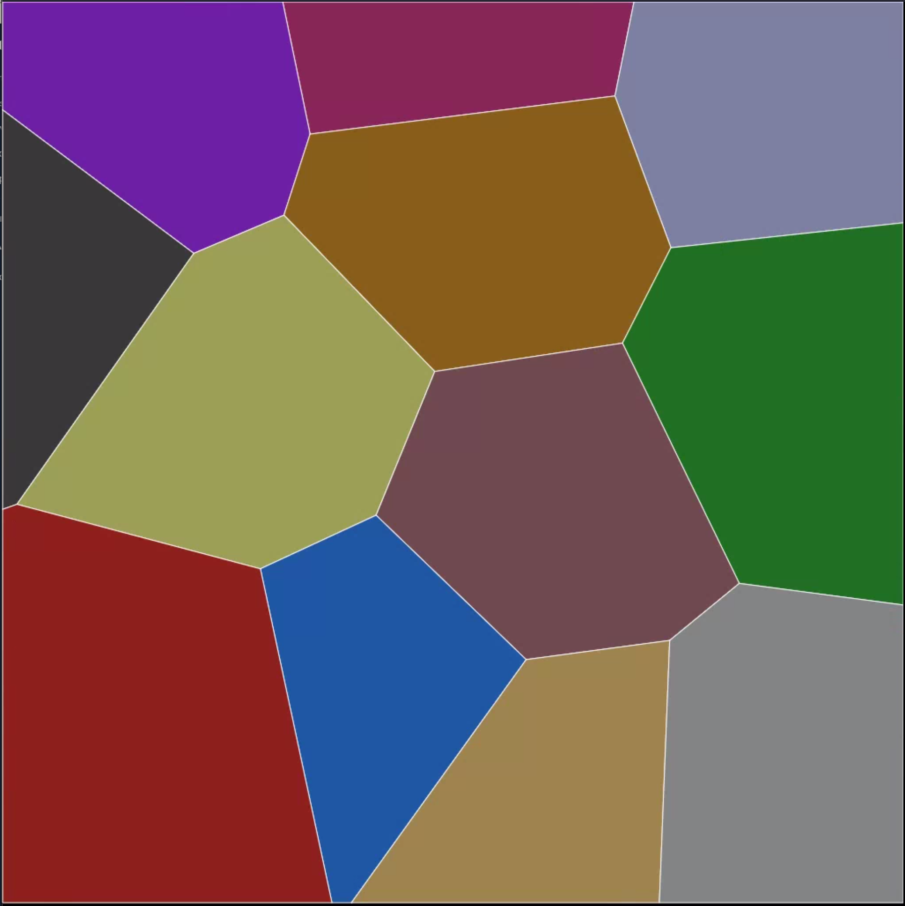

# Math Square Devkit

*Guests exploring a live Math Square behavior at the National Museum of Mathematics, NYC.*

> Build something people will want to step on.

The Math Square is MoMath's signature interactive floor — a 30×30 foot LED canvas
that senses you. Write a behavior and watch strangers play with your math.

&nbsp;&nbsp;**[📖 Jump to Quick Start](#quick-start)**

---

## The Floor

The Math Square sits in the main gallery of the National Museum of Mathematics in
New York City. It runs continuously, seen by hundreds of visitors every day —
from curious kids who run straight for it to mathematicians who stop and stare.

A **behavior** is a small program that decides what the floor shows and how it
responds to the people standing on it. You write the behavior. The floor does the rest.

### Hardware

| Property | Value |
|---|---|
| Display resolution | 1024 × 1024 pixels |
| Sensor grid | 80 × 80 |
| Physical size | ~30 × 30 feet |
| Players | 1 – ~40 simultaneous |

The floor detects people as pressure points on the sensor grid, groups them into
tracked "users" with x/y positions, and passes that data to your behavior 60 times
per second. Your behavior draws to a canvas. That's the whole contract.

---

## Behaviors in the Wild

### Venus


**The math:** Parametric curves — the geometry shifts and breathes in response
to where players stand, producing compound harmonics and interference patterns
that no single person can fully control.

**What makes it good:**

- **Zero players:** The pattern evolves on its own — a living, breathing form
  that draws visitors across the room before they even know what it is.
- **One player:** Step on and the geometry reorganizes around you. Move slowly
  and watch the curves follow. The floor feels like it knows you're there.
- **Many players:** Each person anchors a separate harmonic. The interference
  between them creates patterns that only exist because of the crowd — emergent
  geometry that no individual caused.

The math is the mechanic. You don't need to know what a parametric curve is
to feel that something mathematical is happening underfoot.

---

### Voronoi


*Each color region belongs to the nearest player. The boundary between them moves as they do.*

**The math:** Voronoi tessellation — every pixel on the floor is colored by
whichever player is geometrically closest to it.

**What makes it good:**

- **Zero players:** The floor holds a quietly shifting diagram seeded by ghost
  points — colorful and calm, visible from across the room.
- **One player:** The entire floor is yours. One color, edge to edge.
- **Many players:** The floor divides instantly and fairly. Step toward someone
  and watch the boundary between you negotiate in real time. No one needs to
  explain the rules — players figure it out by playing.

The photo above shows it perfectly: two groups of dancers, two territories, one
living boundary. That's not a game mechanic layered on top of the math —
*that is the math*.

---

## What Makes a Great Behavior

The two behaviors above didn't end up on the floor by accident. They were
designed, tested, revised, and tested again — with real visitors, across every
scenario the floor throws at a program.

That bar is high. Here's what it actually requires.

### The zero / one / many problem

This is the hardest part of building for Math Square, and the thing most
first-time behaviors get wrong.

The floor runs continuously. At any moment it might have:

- **Zero people** — it's 9am, the museum just opened, nobody's there yet
- **One person** — a kid wandered over alone
- **Many people** — a school group just arrived, 30 kids on the floor at once

Your behavior has to be good in all three states. Not just functional — actually
*good*. Each state is a separate design problem:

| State | The challenge |
|---|---|
| **Zero** | The floor is your attract mode. Something beautiful should be happening that draws people over from across the room. A blank or frozen display fails. |
| **One** | One person should feel a direct, legible connection between their body and what's on the floor. They should feel like the floor *knows* they're there. |
| **Many** | The experience should get *more* interesting with more people, not just busier or more chaotic. The best behaviors have emergent properties that only appear at scale. |

Most behaviors are easy to make fun with one person. The zero-player attract
mode and the many-player legibility problem are where most designs break down.

### The full exhibit bar

For a behavior to enter the regular Math Square rotation, it needs to clear
all of these:

- [ ] **Demonstrates a real math concept** — geometry, topology, number theory,
      physics, combinatorics. Something with actual substance, not just a pattern
      that looks mathematical.
- [ ] **The math is the mechanic** — the math explains *why* the floor behaves
      the way it does. You shouldn't need a sign to explain what's happening.
- [ ] **Works and delights at zero, one, and many players** — all three states
      are intentionally designed, not accidental.
- [ ] **Legible without narration** — a visitor who has never heard of the
      concept should be able to intuit something true about it just by playing.
- [ ] **Production quality** — performant, stable, runs unattended for hours.
      No memory leaks. No crashes. Looks good on a 30-foot floor.

```
- start at any point
- no explaination "shouldn't need any explaination to play and enjoy"

```

Venus and Voronoi both clear every one of these. That's why they're in
the rotation.

### What this means for the hackathon

Most projects built in two evenings will not clear this bar — and that's
completely fine.

A behavior that makes people laugh, that shows something surprising, that makes
a kid run back and forth across the floor to see what happens — that's a
successful hackathon project. It doesn't need to be exhibit-ready to be worth
building.

Think of the hackathon as a **first draft**. The exhibit bar is a **later
conversation**. If you build something with legs, the MoMath tech team will
tell you, and there's a path to keep going.

> **The checklist above is a compass, not a grade.** Use it while you're
> designing to make better decisions. Don't let it stop you from shipping
> something fun on Thursday night.

---

## Quick Start

You don't need access to the physical floor to build. Everything works on
your laptop with simulated sensor data.

**Target:** running your first behavior in under 10 minutes.

### Before you clone

Two things will silently break the setup if you skip them:

**1. Node.js 22**
This project requires Node 22. Later versions may work but aren't guaranteed
compatible with Electron. We recommend [nvm](https://github.com/nvm-sh/nvm):

```bash
nvm install 22
nvm use 22
```

**2. Git LFS**
Sensor recording files (`.afr`) are stored with Git Large File Storage.
Install it before cloning or you'll get empty pointer files instead:

```bash
git lfs install
```

### Install and run

```bash
git clone https://github.com/MoMath1/momath.tech.math-square-devkit.git
cd momath.tech.math-square-devkit
npm install
npm run dev
```

A window opens showing the floor. You're running.

**If you see an Electron install error:**
```bash
rm -rf node_modules/electron && npm install electron
```
If that doesn't fix it: `nvm use 22 && rm -rf node_modules && npm install`

### Try the examples

Two example behaviors ship with the devkit:

| Behavior | What you see | What it teaches |
|---|---|---|
| `simple-sensors` | Raw 80×80 sensor grid — green squares for active cells | How the floor sees contact |
| `simple-blobs` | Colored circles tracking each detected person | How the floor tracks people |

Switch between them in `main.ts` near the bottom of the file:

```js
// Raw sensor grid:
const beh = await import('./behs/simple-sensors.js');

// Tracked users as blobs:
const beh = await import('./behs/simple-blobs.js');
```

Save — the window reloads automatically.

### Simulate the floor

| Mode | How to use |
|---|---|
| **Random** | Simulated noise — good for stress-testing |
| **AFR Recording** | Real recorded foot traffic, looped — the closest thing to the live floor |
| **Mouse** | Check the "mouse" box — click and drag to be a person |
| **Server** | Live floor data (only works on MoMath's network) |

> **Tip:** Use **AFR Recording** + **Mouse** together. The recording gives you
> realistic crowd data while the mouse lets you control one person precisely —
> great for testing your behavior at different player counts.

### Write your first behavior

Copy an example and start editing:

```bash
cp behs/simple-blobs.js behs/my-behavior.js
```

Update `main.ts` to load it:

```js
const beh = await import('./behs/my-behavior.js');
```

The only function you need to touch is `render(floor)`. Open
`behs/my-behavior.js` and look for this:

```js
render: function(floor) {
  // floor.users — array of people on the floor
  // each user has: user.x, user.y (0–1024 pixels), user.id
  for (let user of floor.users) {
    // draw something at user.x, user.y
  }
}
```

Change what's drawn at each user's position and you have a behavior.

---

## Writing a Behavior

Behaviors are `.js` files in the `behs/` directory. They use ESM imports
to access core modules:

```js
import * as Display from 'display';
import * as Sensors from 'sensors';
import Floor from 'floor';
```

Each behavior exports a `behavior` object:

```js
export const behavior = {
  title: "My Behavior",
  frameRate: 'animate',
  init: function(container) { /* set up rendering */ },
  render: function(floor) { /* called each frame */ }
};
export default behavior;
```

### Blobbed users (high-level)

Use this when you want to follow people around the floor:

```js
import * as Display from 'display';

export const behavior = {
  title: "My Behavior",
  frameRate: 'animate',

  init: function(container) {
    // set up your canvas here
  },

  render: function(floor) {
    for (let user of floor.users) {
      // user.x, user.y — pixel position (0–1024)
      // user.id        — unique tracking ID per person
    }
  }
};
export default behavior;
```

### Raw sensor grid (low-level)

Use this when you want pixel-level contact data — heat maps, ripples,
cellular automata seeded by foot contact:

```js
import * as Display from 'display';
import * as Sensors from 'sensors';

export const behavior = {
  title: "My Sensor Behavior",
  frameRate: 'sensors',
  maxUsers: 0,   // disables blobbing — raw grid only

  init: function(container) {
    // set up your canvas here
  },

  render: function(floor) {
    for (let y = 0; y < Sensors.height; y++) {
      for (let x = 0; x < Sensors.width; x++) {
        const active = floor.sensors.data[y * Sensors.width + x];
        // 1 if that cell is being stepped on, 0 otherwise
      }
    }
  }
};
export default behavior;
```

### Why not Python

We don't currently have a Python example. Feel free to build one. The basics of getting to the sensor server over WebSocket and sending rendered frames back to the display are the same data contract, different language.

> Use whatever language you're most comfortable with. The floor doesn't care
> how you get there.


## Project Ideas

Not sure what to build? Here are starting points across different areas of math.
These are suggestions, not assignments — follow what excites you.

### Geometry & space
- **Voronoi** *(see above)* — territory and nearest-neighbor geometry
- **Convex hull** — the floor draws the smallest polygon containing all players
- **Symmetry mirror** — reflect and rotate players across axes of symmetry
- **Spanning tree** — connect all players with the shortest possible set of lines

### Motion & physics
- **Gravity** — players are gravitational bodies; particles orbit between them
- **Flocking (Boids)** — a swarm that follows, avoids, or is repelled by players
- **Wave / ripple** — each footstep launches a circular wave outward
- **Sand / fluid** — feet disturb a particle field with physical behavior

### Patterns & emergence
- **Game of Life** — players seed live cells; the pattern evolves on its own
- **Reaction-diffusion** — feet disturb a Turing pattern (Gray-Scott)
- **Cellular automata** — step on cells to flip their rules in real time

### Numbers & algebra
- **Prime spiral** — the floor is a number line; primes light up as players walk
- **Modular arithmetic** — stepping on tiles reveals modular relationships
- **Fibonacci / golden ratio** — spirals and sunflower patterns anchored to players

---

## Architecture

```
sensors.ts  →  floor.ts  →  your behavior  →  display.ts
(80×80 grid)  (user blobs)  (render logic)   (1024×1024 px)
```

### How data flows

1. **Sensors** — the 80×80 grid is read at ~20Hz. Each cell is 0 (empty) or 1
   (active). Raw data is filtered to remove noise and suppress stuck sensors.

2. **Floor** — nearby active cells are grouped into "blobs" and tracked as
   individual `User` objects with `id`, `x`, and `y` in pixel coordinates (0–1024).

3. **Your behavior** — called every frame with the current floor state. Read
   `floor.users` or `floor.sensors` and draw whatever you want.

4. **Display** — your canvas is composited and sent to the floor's
   1024×1024 LED display.

### File structure

```
app.js           — Electron shell (CommonJS, not bundled)
main.ts          — Entry point: connects sensors, loads behavior, runs render loop
sensors.ts       — 80×80 sensor grid, sources, filtering, blobbing/tracking
floor.ts         — High-level user tracking (blobs → User objects with x,y)
display.ts       — Display geometry and coordinate conversions
behs/            — Behavior modules (your code goes here)
documentation/   — AFR format spec, sample recordings, reference materials
types/           — TypeScript type definitions
```

### Build output

```
dist/
├── app.js
├── main.js
├── chunk-*.js
├── behs/
├── dev.html / index.html
├── style.css
├── icon.png
├── prod.json
└── package.json
```

### Scripts

| Command | Description |
|---|---|
| `npm run dev` | Development mode (watch + Electron with DevTools) |
| `npm run build` | Production build (minified, no sourcemaps) |
| `npm run typecheck` | TypeScript type checking |
| `npm run package` | Build + package with electron-forge |
| `npm run make` | Build + make installer with electron-forge |

---

## Network (on-site only)

These addresses only work on MoMath's internal network:

| Service | Address |
|---|---|
| Sensor server | `192.168.72.11:9000` |
| BLAST semaphore | `192.168.72.13:9090` |

For development, use AFR Recording or Random sensor mode — you don't need
network access to build and test.

---

## Production & BLAST

In production, the BLAST app (BrightLogic) schedules and controls behaviors
on the Math Square floor. BLAST launches the devkit with a semaphore GUID;
the app signals readiness by calling back once the first frame renders.

**For hackathon use, you don't need BLAST.** Run `npm run dev`, move the
window to the floor display over HDMI, and you're running on the floor.

See the `documentation/` folder for BLAST integration details if you're
preparing a behavior for production deployment.

---

## Going Further

If you build something at the hackathon that feels like it has legs, talk to
the MoMath tech team at show-and-tell on Thursday night. We'll give you honest
feedback against the exhibit criteria and tell you what the path looks like.

Production deployment involves:
- Code review with the MoMath tech team
- Testing on the real floor across all player states
- Performance and stability testing (unattended hours)
- Integration with BLAST scheduling

It's real work. But Venus and Voronoi both started somewhere.

---

## License

© 2026 National Museum of Mathematics. All rights reserved.
Licensed under the [MoMath Source Available License](LICENSE).
